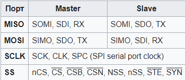
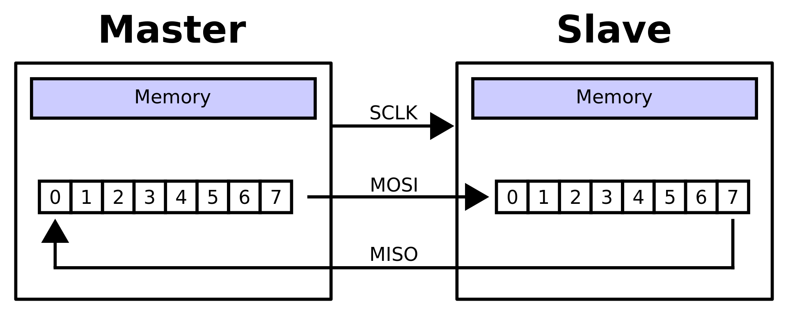
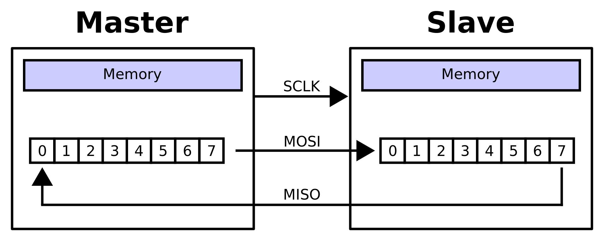
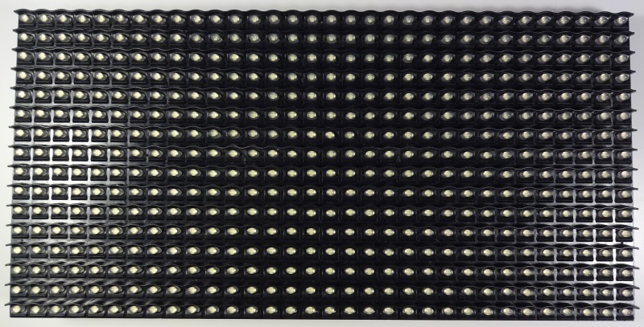
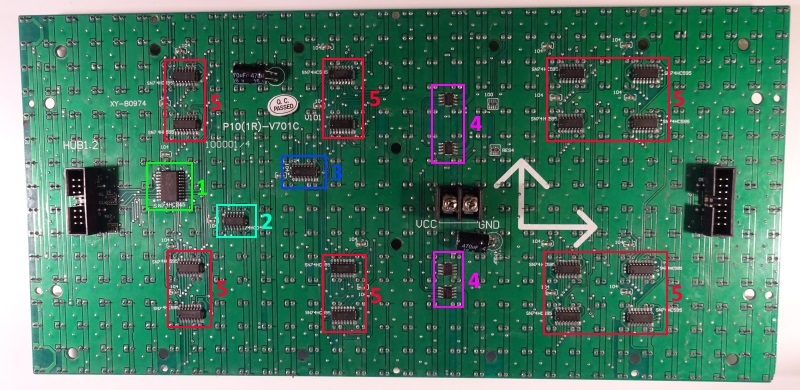
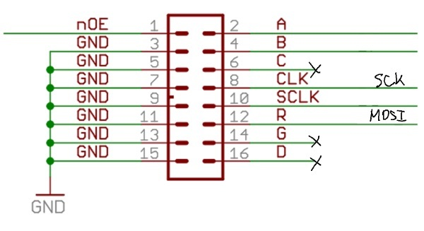
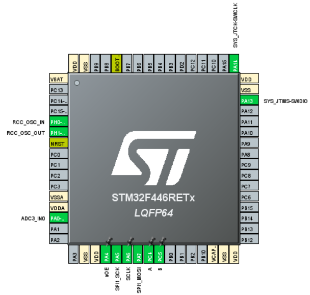

# **Embedded Systems Labs**
Лабораторные работы по дисиплине встраиваемые системы
## Лабораторная работа №1 работа с SPI и P10 Led Board
В ходе даннй работы было необходимо написать игру "змейка"
на языке C
для использования на отадочной плате NUCLEO F446RET6
на базе микроконтроллера от компании STMicroelectronics
управление должно быть организовано при помощи клавиатуры,
работающей подобно потенциометру.

Для выполнения задания необходимо Изучить принцип работы
инетрфейса SPI и связи со светодиодной панелью P10 с
размерностью 16x32 пикселей.

Листинги программного кода предоставлены в директории /Lab_5_fix
в файлах /Core/src/main.c и /Core/src/stm32f4xx_it.c

### Serial Peripheral Interface - SPI
(**Serial Peripheral Interface**, **SPI bus** —
последовательный периферийный интерфейс, шина SPI)
— последовательный синхронный стандарт передачи данных
в режиме полного дуплекса, предназначенный для обеспечения
простого и недорогого высокоскоростного сопряжения
микроконтроллеров и периферии.

В SPI используются четыре цифровых сигнала:

* **MOSI** — выход ведущего, вход ведомого
(англ. Master Out Slave In).
Служит для передачи данных от ведущего устройства ведомому.

* **MISO** — вход ведущего, выход ведомого
(англ. Master In Slave Out).
Служит для передачи данных от ведомого устройства ведущему.

* **SCLK** или **SCK** — последовательный тактовый сигнал
(англ. Serial Clock).
Служит для передачи тактового сигнала для ведомых устройств.

* **CS** или **SS** — выбор микросхемы, выбор ведомого
(англ. Chip Select, Slave Select).

Конкретные имена портов интерфейса SPI могут различаться
в зависимости от производителя аппаратных средств,
при этом возможны следующие варианты:

#### Прием и передача данных в SPI
Передача осуществляется пакетами.
Длина пакета, как правило, составляет 1 байт (8 бит),
при этом известны реализации SPI с иной длиной пакета,
например, 4 бита.
Ведущее устройство инициирует цикл связи установкой
низкого уровня на выводе выбора подчиненного устройства (SS)
того устройства, с которым необходимо установить соединение.
При низком уровне сигнала SS:

* схемотехника ведомого устройства находится в активном состоянии;
* вывод MISO переводится в режим «выход»;
* тактовый сигнал SCLK от ведущего устройства
воспринимается ведомым и вызывает считывание
на входе MOSI значений передаваемых от ведущего
битов и сдвиг регистра ведомого устройства.

Подлежащие передаче данные ведущее и ведомое устройства помещают
в сдвиговые регистры. После этого ведущее устройство начинает
генерировать импульсы синхронизации на линии SCLK, что приводит
к взаимному обмену данными. Передача данных осуществляется бит
за битом от ведущего по линии MOSI и от ведомого по линии MISO.
Передача осуществляется, как правило, начиная со старших битов,
но некоторые производители допускают изменение порядка передачи
битов программными методами. После передачи каждого пакета данных
ведущее устройство, в целях синхронизации ведомого устройства,
может перевести линию SS в высокое состояние.

#### Преимущества и недостатки интерфейса SPI
##### Преимущества:

* Полнодуплексная передача данных по умолчанию.

* Более высокая пропускная способность по сравнению с I²C или SMBus.

* Возможность произвольного выбора длины пакета, длина пакета не ограничена восемью битами.

* Простота аппаратной реализации:

  * более низкие требования к энергопотреблению по сравнению с I²C и SMBus;

  * возможно использование в системах с низкостабильной тактовой частотой;

  * ведомым устройствам не нужен уникальный адрес, в отличие от таких интерфейсов, как I²C, GPIB или SCSI.

* Используется только четыре вывода, что гораздо меньше, чем для параллельных интерфейсов.

* Однонаправленный характер сигналов позволяет при необходимости легко организовать гальваническую развязку между ведущим и ведомыми устройствами.

* Максимальная тактовая частота ограничена только быстродействием устройств, участвующих в обмене данными.

##### Недостатки
* Необходимо больше выводов, чем для интерфейса I²C.
* Ведомое устройство не может управлять потоком данных.
* Нет подтверждения приема данных со стороны ведомого устройства (ведущее устройство может передавать данные «в никуда»).
* Нет определенного стандартом протокола обнаружения ошибок.
* Отсутствие официального стандарта, что делает невозможным сертификацию устройств.
* По дальности передачи данных интерфейс SPI уступает таким стандартам, как UART и CAN.
* Наличие множества вариантов реализации интерфейса.
* Отсутствие поддержки горячего подключения устройств.

### P10 Светодиодная панель
**P10 Светодиодная панель** или **P10 Led Board** предстваляет собой
панель состоящую из корпуса, светодиодов и управляющих микросхем.
Размерность светодиодной панели в пикселях равна 16 по высоте и
32 по ширине. Управление светодиодной панелью осуществляется
через интерфейс SPI, что позволяет подключать несколько панелей
последовательно и масшатибровать размерность панели.

Распиновка входного разъёма

#### Логика обновления экрана (точнее четверти экрана) выглядит следующим образом:
1. Выдаём по SPI данные для сдвиговых регистров.
Для одной матрицы 32x16 это 16 байт (16 8-битных регистров).
2. Устанавливаем лог. 0 на ножке nOE.
3. Устанавливаем лог. уровни на ножках A и B в соответствии
с обновляемой группой светодиодов (одной из четырёх).
Это подаёт +5В на аноды светодиодов выбранной группы.
4. Выдаём на ножку SCLK короткий положительный импульс.
Это подаёт землю на катоды светодиодов в соответствии
с загруженными в регистры байтами.
5. Устанавливаем лог. 1 на ножке nOE.
При этом четверть экрана (одна группа светодиодов)
загорается и горит до следующего обновления следующей группы светодиодов.

Повторяем пункты 1-5 с постоянным периодом.

Распиновка микроконтроллера выглядит следующим образом

## Лабораторная работа №2 работа с USB, RaspberryPi, STM32 и P10 Led Board
